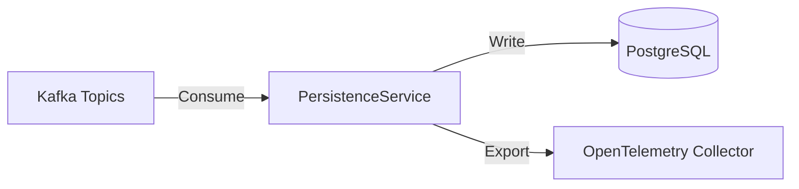

# PersistenceService Architecture

The `PersistenceService` is designed to be a highly available and resilient component that bridges the gap between event streams (Kafka) and permanent storage (PostgreSQL).

## Overview

## Core Components

### 1. KafkaComicListener (BackgroundService)
This is the heart of the service. It runs as a `BackgroundService` that:
- Initializes the Kafka consumer with a Polly retry policy.
- Checks for database readiness before starting to consume.
- Implements a buffered batching strategy to process multiple events before flushing to the database.
- Tracks consumer lag and processes metrics.

### 2. Data Persistence Layer
- **DbContexts**: Two database contexts (`EventDbContext` and `ComicCollectionDbContext`) manage the interaction with PostgreSQL.
- **Repositories**: Standardize access to domain entities like `ComicRecordEntity` and `EventEntity`.
- **EF Core**: Uses Npgsql with built-in retry strategies to handle transient database failures.

### 3. Resilience & Readiness
- **DatabaseReadyChecker**: Ensures that the target database and its schema (via migrations) are ready before the service begins full operations.
- **Polly Policies**: Integrated into both the Kafka connection and EF Core database operations.

### 4. Observability
- **Metrics**: Exposes critical health indicators like `process_uptime_seconds`, `saved_comics_total`, `kafka_consumer_lag`, and database readiness.
- **Tracing**: Fully integrated with OpenTelemetry to trace requests and background operations.

## Design Patterns

- **Hosted Services**: Utilizes `BackgroundService` for long-running consumption logic.
- **Dependency Injection**: Extensively uses .NET's DI for configuration, logging, and infrastructure services.
- **Unit of Work**: Managed through Entity Framework Core's `DbContext`.
- **Batch Processing**: Reduces I/O overhead by buffering incoming Kafka messages and performing bulk inserts.

## Testing Strategy

The service is accompanied by a robust test suite:
- **Unit Tests**: Focus on mapping logic and domain entity behavior.
- **Integration Tests**: Verify the interaction between the listener, repositories, and a live database (using Docker/Testcontainers when possible).
- **Data Generators**: Specialized helpers to create consistent test datasets.
